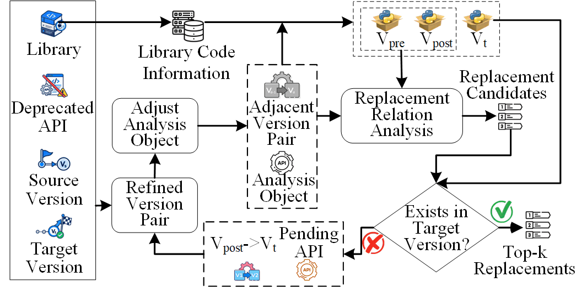

# PEAR

**Evolution-Aware Replacement API Recommendation for Cross-Version Library Upgrades**



## What is PEAR?

PEAR (**P**ython **E**volution-**A**ware **R**ecommender) is a prototype tool for recommending replacement APIs during cross-version upgrades of Python third-party libraries.

Given a library, a source version \(V_s\), a target version \(V_t\), and the fully qualified name (FQN) of a deprecated API, PEAR accounts for API evolution between \(V_s\) and \(V_t\) and returns a ranked list of replacement API candidates.

PEAR localizes the source-level removal boundary, resolves evolution relations when available, and propagates candidates toward the target version when necessary.

## Quick Start

### Requirements

- Linux
- Python 3.13+
- A local Git repository of the target library

Create a configuration file under `Configure/`:

```json
{
    "libName": "pandas",
    "sourceVersion": "0.23.4",
    "targetVersion": "1.0.0",
    "oldApiFqn": "pandas.core.indexes.multi.MultiIndex.set_labels",
    "apiType": "method",
    "topK": 3,
    "libRepoPath": "/path/to/pandas_repo"
}
```

Build the version-specific API knowledge base:

```shell
python main.py build -cfg Configure/example.json
```

Generate replacement recommendations:

```shell
python main.py recommend -cfg Configure/example.json
```

Use `--jobs N` with `build` for parallel extraction and `--cache-dir DIR` with `recommend` to specify the code cache directory.

## Output

PEAR returns a similarity-ranked list of replacement API candidates in the target version.

## Preliminary Evaluation

The data, results, and reproduction scripts for our preliminary evaluation are available in [`PreliminaryEvaluation/`](./PreliminaryEvaluation/).

The evaluation contains 161 documented deprecated-API–replacement mappings collected from Django, Matplotlib, and Pandas.

The directory includes the evaluation cases, intermediate and final recommendation results, selected case artifacts, and scripts for reproducing the evaluated methods.

## License

PEAR is licensed under the GNU Affero General Public License v3.0. See [LICENSE.txt](./LICENSE.txt) for details.

Third-party contents under `CodeCache/` and `PreliminaryEvaluation/paper_cases/` remain subject to their respective upstream licenses.